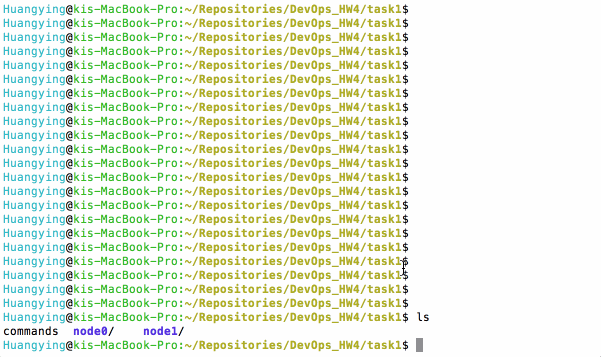
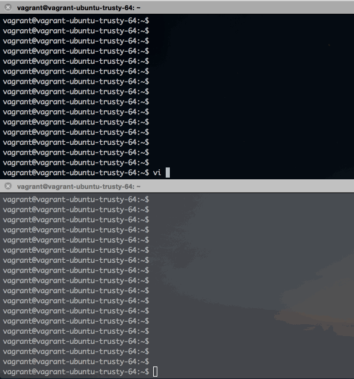
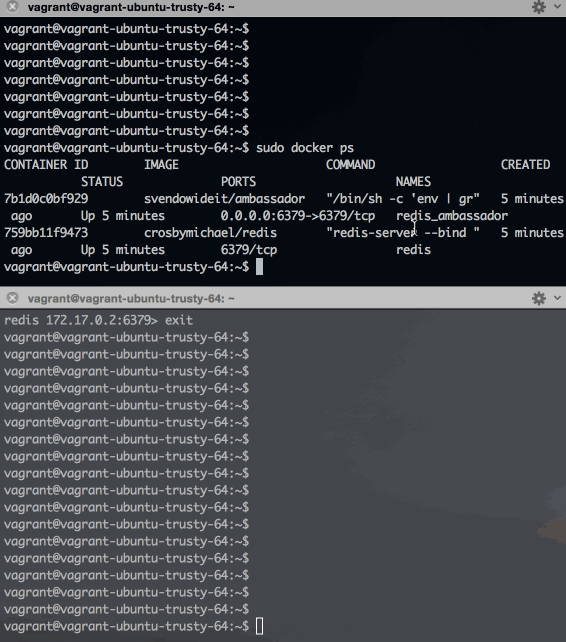

##DevOps HW4

### File IO
#####Build two images:    
In task1/node0 fold, run `docker build -t task1fileout .`    
In task1/node1 fold, run `docker build -t task1filein .`
#####Run two container from those images:   
`docker run -d --name fileout task1fileout`    
`docker run —it link fileout:fileout --name filein task1filein`

#####Demo:


### Ambassador pattern
##### two vagrant vitual machine    
`vagrant init ubuntu/trusty64`
uncomment `config.vm.network "public_network"` in Vagrantfile to use Bridged network attachment type, then choose the first option.

#### download docker and docker-compose in vm

```
curl -sSL https://get.docker.com/ | sh

sudo -i
\# curl -L https://github.com/docker/compose/releases/download/1.5.1/docker-compose-`uname -s`-`uname -m` > /usr/local/bin/docker-compose
\# chmod +x /usr/local/bin/docker-compose
\# exit

```

##### containers
In host1(ip: 10.139.56.55), run a redis container using   
`docker run -d --name redis crosbymichael/redis`     
And a redis_ambassador container, which map the host 6379 port to the container 6379 port:    
`docker run -d --link redis:redis --name redis_ambassador -p 6379:6379 svendowideit/ambassador`     
In host2, run another redis_ambassador container uisng:
`docker run -d --name redis_ambassador --expose 6379 -e REDIS_PORT_6379_TCP=tcp://10.139.56.55:6379 svendowideit/ambassador`    
The command set the environment varible REDIS_PORT_6379_TCP to the ip and port of host1, which allow the redis_ambassador connect to the redis_ambassador on host1.   
Then run a client container using:   
`docker run -i -t --rm --link redis_ambassador:redis relateiq/redis-cli`    
The client container will be linked to the redis_ambassador.
##### docker-compose
stop and rm all container using    
`sudo docker stop $(docker ps -a -q)`       
`sudo docker rm $(docker ps -a -q)`

in host1: write docker-compose.yml using two service redis and redis_ambassador to run those two containers.

```
redis:
  image: crosbymichael/redis
  container_name: "redis"
redis_ambassador:
  image: svendowideit/ambassador
  container_name: "redis_ambassador"
  ports:
   - "6379:6379"
  links:
   - redis:redis
```

In host2: write one service redis for the redis_ambassador container, another service client for the client container.


```
redis_ambassador:
  container_name: "redis_ambassador"
  image: svendowideit/ambassador
  expose:
   - "6379"
  environment:
   REDIS_PORT_6379_TCP: tcp://10.139.56.55:6379

client:
  container_name: "client"
  image: relateiq/redis-cli
  links:
   - redis_ambassador:redis
   
```

Run `sudo docker-compose up -d` in host1, 
then run    
`sudo docker-compose up -d redis_ambassador`   
`sudo docker-compose run client` in host2.    
run redis command in client:
`SET key 'Hello!'`
`GET key`

#####Demo
    
client perform 'SET/GET'     


### Docker Deploy


